When publishing results obtained with this set of **WaNos** please consider citing it. 

### Acknowledgement
This project has received funding from the European Union’s Horizon 2020 research and innovation programme under grant agreement No 957189. The project is part of BATTERY 2030+, the large-scale European research initiative for inventing the sustainable batteries of the future.

# SEI-Model-Active-Learning
Workflow for Solid Electrolyte Interface (SEI) model within Active Learning approach

## Python dependencies

* pip install torch torchvision torchaudio
* pip install gpytorch
* conda install scipy=1.7
* pip install seaborn=0.12.2
* pip install scikit-learn==1.2.1
* pip install pyyaml

## Starting the Workflow
There are two options for using the workflow: 1) collaborating team installing and using the workflow on their own machines, 2) collaborating team that want to choose the INT-Nano resources.
For the first option, these are the checklist: 
 - Making sure starting multiple jobs is allowed on your cluster (for the advanced loop in the workflow)
 - Making sure nodes with identical computational power and arcitecture can be allocated (more import for large clusters)
 - Making sure you are allowed to upload pickle files to the cluster
 
After making sure these conditions are met, the steps for starting the workflow are:
 - Recreating the 50,000 dataset on you own cluster (necessary instructions can be provided by us)
 - Receiving the Simstack server from us, which should be installed on your cluster
 - Downloading the Simstack client, and the WaNOs
 - Starting the workflow

For the second option, the collaborating team needs only to obtain access to the INT-Nano cluster, have the Simstack server installed for them, and download the Simstack client program and the WaNOs.
From now, we assume all the preconditions for starting the workflow are met. 

Step 1) Create the workflow by dragging the WaNOs into the workspace one by one.

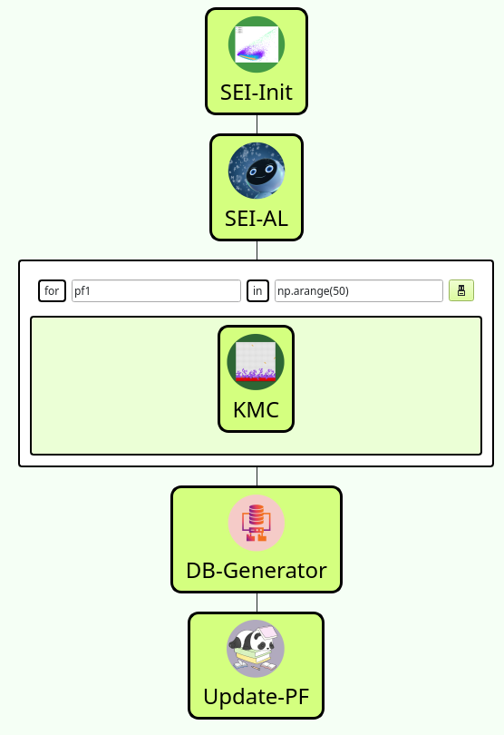

Step 2) The pickle file (npy) is the collection of 50,000 output from the descriptor that is applied to kMC model output, and the json file is the main 50,000 reaction barrier. These files are stored in a folder and their addresses are passed to the SEI-Init WaNO. 

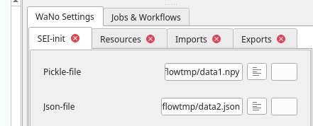

Step 3) Make sure to tick the "Reuse the existing results" for SEI-Init, and remove it for all other WaNOs.

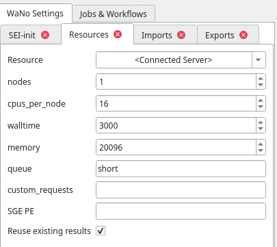

Step 4) On SEI-AL WaNO, the initial input is AL cycle, the next, is the number of iterations. In the next boxes, the K-mean model (KM.model), FastICA model (FastICA.model), kernel PCA model (KPCA.model), and Tdata.json are inherited from SEI-Init WaNO. By clicking on the button to the far right of the textbox, a drop list is opened, and by inserting the name of the relevant file, the file is automatically assigned. In the next cycles, all other fields remain the same, only Tdata becomes a file that is from the previous cycle.

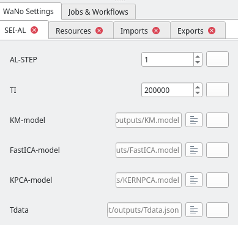

Step 5) Check the resources for SEI-AL WaNO

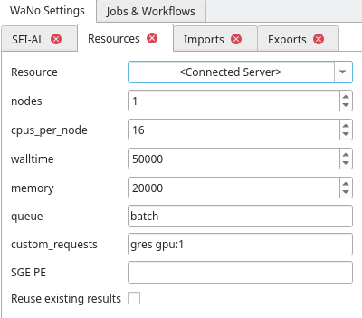

Step 6) The advance loop for kMC calculation needs a name for the index (here pf1), and a range of values. By clicking on the button on the side of "kmc-index", and typing "$", you can find the index from the list.
The PF.json file is inherited from SEI-AL WaNO and should be chosen from the list, by clicking on the button next to it. For the walltime, make sure there is enough given. Although the simulations last 1800 seconds, the gathering and storing the data can last longer.

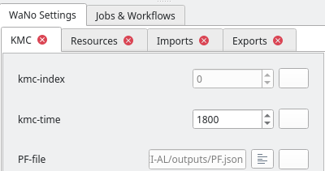
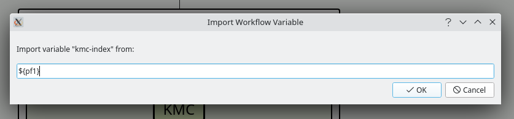

Step 7) The DB-Generator WaNO needs a name (here db-Workflow). The option Full-DB should be ticked. This WaNO creates a file that can be downloaded manually for data visualization using the "SEI_Active_Learning_Workflow.ipynb" notebook. The file should be given a name in the pattern of "db-Workflow-c#.yml" where # is the AL cycle number.

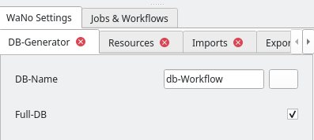
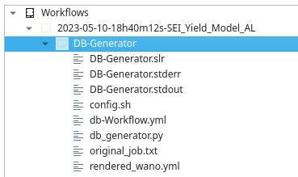

Step 8) The Update-PF WaNO needs a list of input files from previous WaNO. The fields remain the same for all cycles, except Tdata, which is after the first cycle comes from the previous cycle. This WaNO creates a file named "TdataUP.json" which is manually downloaded and its address is given to SEI-AL, and Update-PF in the next cycle of active learning.

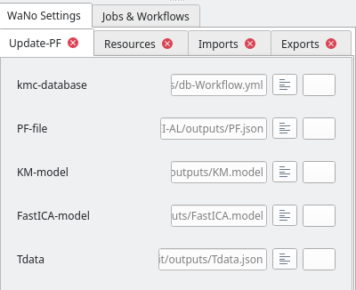
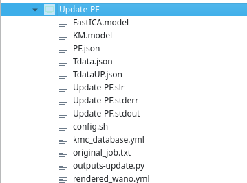

